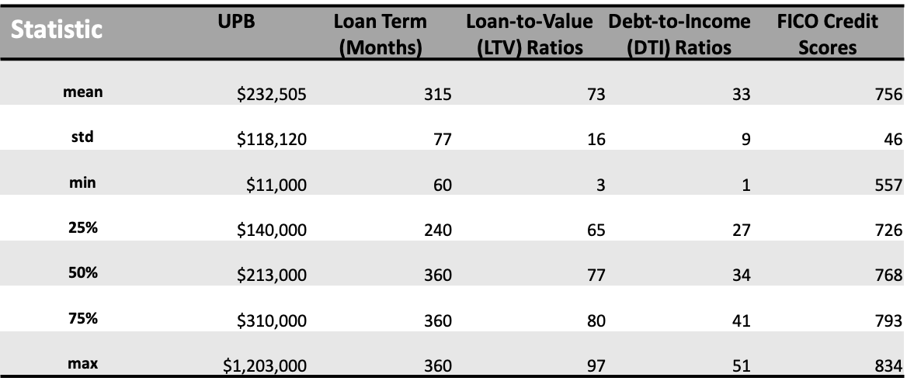
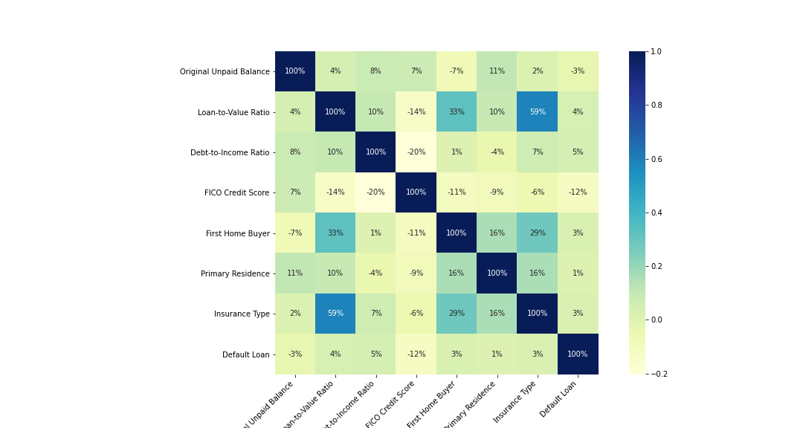
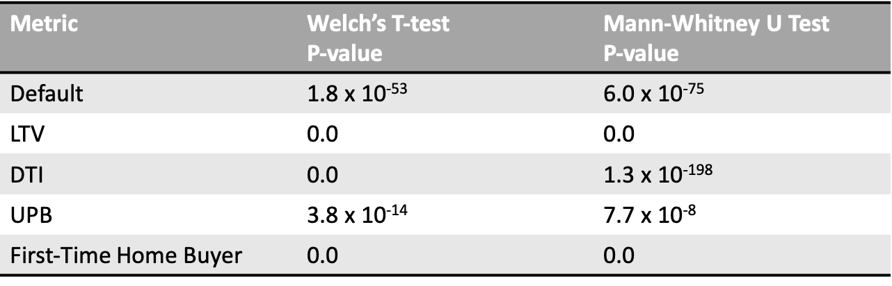

# Analysis of Mortgage Insurance and Fannie Mae MBS Loan Defaults and Other Metrics

### Table of Contents  
[Description](#description)  
[Data Overview](#data-overview)  
[Data Preparation](#data-preparation)   
[Exploratory Data Analysis](#exploratory-data-analysis) 
[Hypothesis Tests: Insured vs. Uninsured Loans](#hypothesis-tests-insured-vs-uninsured-loans)  
[Summary: Insured vs. Uninsured Loans](#summary-insured-vs-uninsured-loans)  
[Hypothesis Tests: Borrower Paid vs. Lender Paid Insured Loans](#hypothesis-tests-borrower-paid-vs-lender-paid-insured-loans)  
[Summary: Borrower Paid vs. Lender Paid Insured Loans](#summary-borrower-paid-vs-lender-paid-insured-loans) 

## Description

The Federal National Mortgage Association (FNMA), generally known as Fannie Mae, is a government-sponsored enterprise (GSE) that aims to make mortgages affordable for moderate- and low-income borrowers. Fannie Mae invests in the mortgage market by pooling loans into mortgage-backed securities (MBS). Each loan is backed by a single family or multiple families of borrowers who use the loan to finance the purchase of a home or property. 

Fannie Mae requires mortgage insurance for borrowers whose loan-to-value (LTV) ratios are 80% or higher in order to offset risk to the lender. Mortgage insurance protects lenders in the event that borrowers default on payments or otherwise cannot meet their contractual mortgage obligations. These borrowers are required to pay monthly premiums, and can choose to either pay themselves, or have the lender/third parties pay (at the cost of higher monthly interest rates). See https://singlefamily.fanniemae.com/media/9596/display

This project looks at the relationship between mortgage insurance and Fannie Mae mortgage-backed security (MBS) loan defaults and other loan-borrower characteristics. In particular, I investigate the following questions using both exploratory data analysis and hypothesis testing: 

1)  Are there differences in default occurrence and other characteristics between loans that are insured vs. loans that are not insured?
2)  For loans that are insured, are there differences in these characteristics between loans where borrowers pay premiums vs. loans where lenders pay premiums? 

These questions explore implications for borrower incentives and risk characteristics, and how they influence borrower behavior in the context of missed payments.

## Data Overview

The data comes from Fannie Mae's publicly available Single-Family Fixed Rate 30-year and less mortgage datafiles, which consists of two file types. The “Acquisition” dataset is at the loan-level and contains static loan characteristics such as original principal balance, date of origination, borrower FICO credit score, loan-to-value (LTV) ratio, debt-to-income (DTI) ratio, occupancy type, first-time-home buyer indicator, and mortgage insurance type. The “Performance” dataset is at the loan- and month-level, and provides monthly performance data of each mortgage loan since the time of Fannie Mae’s acquisition up through the current status (or until the mortgage loan liquidates, pays off, or is repurchased). The variables used in this project are described according to Fannie Mae's data dictionary below.

### Acquistions Dataset

**Loan Identifier:** Unique alphanumeric identifier for each loan. 
**Original UPB:**  The dollar amount of the loan as stated on the note at the time the loan was originated. 
**Origination Date:** Date of origination for each loan. 
**Original Loan to Value Ratio (LTV):** The ratio, expressed as a percentage, obtained by dividing the amount of the loan at origination by the value of the property. 
**Original Debt-To-Income (DTI):** The ratio obtained by dividing the total monthly debt expense by the total monthly income of the borrower at the time the loan was originated. 
**Original FICO Credit Score:** A numerical value used by the financial services industry to evaluate the quality of borrower credit. Credit scores are typically based on a proprietary statistical model that is developed for use by credit data repositories. These credit repositories apply the model to borrower credit information to arrive at a credit score. When this term is used by Fannie Mae, it is referring to the "classic" FICO score developed by Fair Isaac Corporation. 
**First Time Home Buyer Indicator:** An indicator that denotes if the borrower or co-borrower qualifies as a first-time homebuyer. Y = Yes, N = No. 
**Occupancy Status:** The classification describing the property occupancy status at the time the loan was originated. Principal = P; Second = S; Investor = I; Unknown = U. From this, I created a dummy indictor variable for loans backed by "Principal", or "Primary Residence" properties vs. non-Principal properties. 
**Mortgage Insurance Type:** The entity that is responsible for the Mortgage Insurance premium payment. 
1 = Borrower Paid
2 = Lender Paid
3 = Enterprise Paid 
Null = No MI

### Performance Dataset

**Monthly Reporting Period:** The month and year that pertains to the servicer’s cut-off period for mortgage loan information. 
**Current Loan Delinquency Status:** The number of months the obligor is delinquent as determined by the governing mortgage documents.

## Data Preparation

Aside from data cleaning and variable transformation (for details, see [loan-eda-hypothesis-testing.ipynb](loan-eda-hypothesis-testing.ipynb)), I also subset the data to only loans originated in Q1 2015. For each loan, I then tracked performance for four years from the loan's origination date, and defined default as any instance of 90+ day-delinquency (3+ months of missed payments) in that four-year period. This resulted in a loan-level dataset containing 266,662 loans. 

I grouped my metrics of interest into two categories:

**Credit Risk Metrics**

-Default Incidence  
-Debt-to-Income Ratio (DTI)  
-Loan-to-Value Ratio (LTV) 
-Original Unpaid Principal Balance (UPB) 
-First-Time Home Buyer 

**Credit Worthiness Metrics**

-FICO Credit Scores 
-Primary Residence

Risk metrics measure how risky borrowers are: for instance, if borrowers default a lot, then they likely pose high risk to both lenders and investors. Worthiness metrics measure how credit-worthy borrowers are: if they have high FICO scores, then they’re probably safer investments. The goal is to see whether these metrics differ meaningfully between: a) insured vs. uninsured loans, and b) insured (borrower-paid premiums) vs. insured (lender-paid premiums) loans.

## Exploratory Data Analysis

The below table contains some summary statistics for the loans in my dataset.

Additionally, 1.0 % of these loans default in the Q1 2015 – Q1 2019 period, 14.0 % are first-time-home purchases, and 86.8 % are primary residences. The takeaway is that these are relatively high-quality loans, with high average FICO scores and very few defaults in the Q1 2015 - Q1 2019 period. Any significant differences in loan metrics would be especially interesting. 

There are 201,921 uninsured loans (76%), and 64,741 insured loans (24%).

Even though these loans generally don’t default often, insured loans (especially borrower paid ones, which default more than twice the rate of uninsured loans) default much more frequently than uninsured loans.

The below correlation matrix shows how our loan metrics of interest relate to one another. We see that the highest correlation is between LTV and mortgage insurance type at 0.59, which makes sense given Fannie Mae's insurance requirement for high LTV ratios. There otherwise does not seem to be especially high correlations amongst these metrics, even across different insurance types (see [Correlation (Uninsured)](images/corr_uninsured.png), [Correlation (Insured-Borrower)](images/corr_insured_borr.png), [Correlation (Insured-Lender)](images/corr_insured_lend.png). This implies that we can test these metrics separately.

## Hypothesis Tests: Insured vs. Uninsured Loans

### Credit Risk Metrics

**H0: Uninsured loans have the same credit risk metric values as do insured loans.** 
**HA: Uninsured loans have different credit risk metric values than do insured loans.**

Based on the distribution plots, insured loans have higher risk metric means and proportions than uninsured loans. For defaults specifically, even though very few loans default in the first place, the default rate for insured loans is more than double that of uninsured loans. Insured loans also have higher DTI, LTV, unpaid principal balances, and proportion of first-time home purchases.

    
   
                                                                                                                                   
The above distributions are skewed and the sample variances are not equal, so I used both a Welch's t-test and a Mann-Whitney U test for robustness, using an alpha of 0.05.

Based on the p-values, I reject the null hypothesis that the risk metric means and proportions are equal for all risk metrics at the 5% significance level.

### Credit Worthiness Metrics

**H0: Uninsured loans have the same credit worthiness metric values as do insured loans.** 
**HA: Uninsured loans have different credit worthiness metric values than do insured loans.** 

Based on the distribution plots, insured loans have lower average FICO scores but interestingly also a higher proportion of primary residences compared to uninsured loans.

    

Based on the p-values, I reject the null hypothesis that the worthiness metric means and proportions are equal for all worthiness metrics at the 5% significance level.

However, using seven metrics, the probability that we get at least one significant result due to random chance is 1 - (1 - 0.05)7
 = 30.2%! This is where the Bonferroni correction comes in.

Although the adjusted p-values are slightly larger, we still reject the null hypothesis for all metrics.

## Summary: Insured vs. Uninsured Loans

For insured vs. uninsured loans, we see significant differences in all metrics, and the distributions generally imply that insurance is an indicator of borrower riskiness. This isn’t too surprising: since only borrowers with high enough LTV ratios (80%) are required to get mortgage insurance in the first place, they may also exhibit other risky characteristics (such as higher debt and higher proportion of first-time home purchases) and risky behavior (such as higher defaults) compared to uninsured borrowers. Even though these loans are already relatively high-quality across all insurance types, these differences are still substantive. 
 
 
 
## Hypothesis Tests: Borrower Paid vs. Lender Paid Insured Loans

### Credit Risk Metrics

**H0: Insured loans (borrower-paid premiums) have the same credit risk metric values as do insured loans (lender-paid premiums).** 
**HA: Insured loans (borrower-paid premiums) have different credit risk metric values than do insured loans (lender-paid premiums).**

Based on the distribution plots, insured loans where borrowers pay premiums generally have higher risk metric means and proportions than do insured loans where lenders pay premiums. Insured (borrower-paid) loans have higher defaults (1.83% vs. 1.01%), higher LTV, and a higher proportion of first-time home purchases. However, they also have slightly lower DTI's and original unpaid balances.   

    
   
   

Again I use both a Welch's t-test and a Mann-Whitney U test for my hypothesis tests.

Based on the p-values, I reject the null hypothesis that the risk metric means and proportions are equal for all risk metrics.

### Credit Worthiness Metrics

**H0: Uninsured loans have the same credit worthiness metric values as do insured loans.** 
**HA: Uninsured loans have different credit worthiness metric values than do insured loans.**

The plots show that insured loans where borrowers pay premiums have lower average FICO scores and proportion of primary residences compared to insured loans where lenders pay premiums.

   

Based on the p-values, I reject the null hypothesis that the worthiness metric means and proportions are equal for all worthiness metrics.

After applying the Bonferroni correction, I still the reject the null hypothesis for all metrics.

## Summary: Borrower Paid vs. Lender Paid Insured Loans

My findings generally imply that insured loans where borrowers pay premiums exhibit riskier attributes (higher defaults, higher LTV, more first-time home purchases, lower FICO, and fewer primary residences) compared to insured loans where lenders pay premiums. If borrowers choose to have lenders pay their premiums, they get higher monthly interest rates, and oftentimes pay more over the lifetime of the loan as compared to when borrowers pay their own premiums. Borrower-paid insurance is a temporary expense that can be eliminated once borrowers have 20 percent equity their homes. However, in the case where lenders pay, the cost is spread out over the life of the loan so that monthly payments don't increase by much, whereas monthly payments will increase relatively more for borrowers who pay their own premiums.  It's possible that borrowers who have lenders pay will be less likely to miss payments because they are paying a smaller amount every month compared to borrowers who pay themselves (even though they end up paying more overall). There may also be additional fine-print qualifications to get lenders to pay for premiums in the first place. In any case, it would be interesting to further investigate these findings and interacting effects.

Interestingly, I see the opposite effect for unpaid principal balances and DTI ratio risk metrics, where borrower-paid insured loans actually had significantly lower balances and slightly lower DTI's compared to lender-paid insured loans. One possible explanation is that these metrics may not be the best proxies for borrower riskiness: maybe more responsible borrowers who default less often can also afford more expensive homes and therefore incur larger mortgages and unpaid balances/debt relative to their incomes. In any case, I'd like to examine these effects further and see if my findings generally hold for loans originated in other years, loans backed by subprime borrowers, and/or other types of loans. 

